# Anomaly Detection Method Map (Image Anomaly Detection)

## Bird's-eye View (Mermaid Map)

```mermaid
flowchart TB
  D0[Datasets]
  D1[DAGM 2007]
  D2[NanoTWICE 2018]
  D3[MTD 2018]
  D4[MVTec AD 2019]
  D5[BTAD 2021]
  D6[MVTec LOCO 2022]
  D0 --> D1
  D0 --> D2
  D0 --> D3
  D0 --> D4
  D0 --> D5
  D0 --> D6

  subgraph A[Reconstruction based AE GAN]
    A1[AnoGAN 2017 star]
    A2[ADGAN 2018]
    A3[GANomaly 2018]
    A4[EGBAD 2018]
    A5[AnoVAEGAN 2018]
    A6[MemAE 2019]
    A7[Skip GAN 2019]
    A8[DAGAN 2020]
    A9[DAAD 2021 star]
    A10[OCGAN 2019]
    A11[SSIM AE 2019]
    A12[ADAE 2019]
    A13[DSEBM 2016]
    A14[CNN Dict 2018]
    A15[VAE grad 2020]
    A16[CutPaste 2021 star]
    A17[DRAEM 2021 star]
    A1 --> A2
    A1 --> A3
    A1 --> A4
    A1 --> A5
    A2 --> A6
    A3 --> A7
    A7 --> A8
    A6 --> A9
  end

  subgraph F[Feature based Five Families]
    F0[DAGMM 2018]
    F1[DSVDD 2018]
    F2[PatchSVDD 2020]
    F0 --> F1
    F1 --> F2

    subgraph G[1 Gaussian]
      G1[Student 2020]
      G2[Gaussian AD 2020]
      G3[PaDiM 2021 star]
      G1 --> G2
      G2 --> G3
    end

    subgraph N[2 Nearest Neighbor Search]
      N1[DN2 2020]
      N2[SPADE 2020]
      N3[PatchCore 2022 star]
      N4[ReConPatch 2023]
      N5[PNI 2023]
      N1 --> N2
      N2 --> N3
      N3 --> N4
      N3 --> N5
    end

    subgraph L[3 Alignment]
      L1[RegAD 2022]
      L2[CPR 2023 star]
      L1 --> L2
    end

    subgraph T[4 Distillation]
      T1[STAD 2020]
      T2[EfficientAD 2023 star]
      T1 --> T2
    end

    subgraph W[5 Flow]
      W1[DifferNet 2021 star]
      W2[CS Flow 2022]
      W3[FastFlow 2021 star]
      W4[MS Flow 2023]
      W1 --> W2
      W1 --> W3
      W3 --> W4
    end
  end

  subgraph C[Non DL Classical]
    C1[KDE GMM]
    C2[OC SVM 2001]
    C3[SVDD 2004]
    C4[LOF 2000 IF 2008]
  end

  subgraph B[Foundational Methods Adjacent Fields]
    B1[VAE 2014]
    B2[Normalizing Flow 2015]
    B3[Real NVP 2017]
    B4[GAN 2014]
    B5[DCGAN 2016]
    B6[AlexNet 2012]
    B7[ResNet 2016]
    B8[EfficientNet 2019]
    B2 --> B3
    B4 --> B5
    B6 --> B7
    B7 --> B8
  end

  B1 --> A1
  B3 --> W1
  B5 --> A1
  B8 --> F1
  C3 --> F1
```

> ★ indicates methods emphasized as important techniques in the original map.

---

## Reading Notes

- **Good starting points for beginners**: `AnoGAN` (reconstruction line), `PaDiM` and `PatchCore` (feature-based line)
- **Main trend since 2020**: shift from pure reconstruction error toward **pretrained features + statistical / nearest-neighbor modeling**
- **Recent practical trend**: lightweight and faster methods (e.g., `EfficientAD`) and handling more complex defects (e.g., `MVTec LOCO`)
