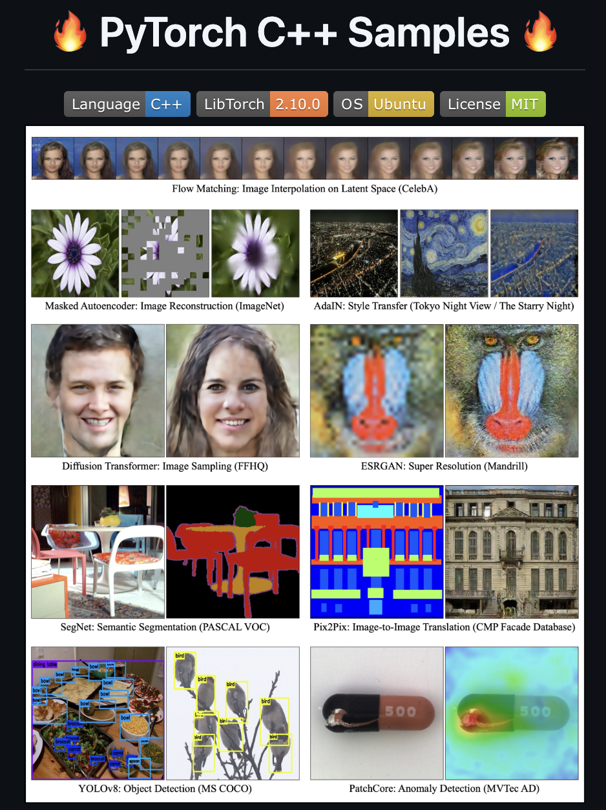

# [Announcement] PyTorch C++ Sample Programs

I have written a lot of PyTorch C++ sample programs, so I’d like to share them here!

Repository: https://github.com/koba-jon/pytorch_cpp

<br>

## 1. Repository Overview

This repository reimplements major deep learning models using the PyTorch C++ API (LibTorch), aiming for research and production environments that do **not** depend on Python.

It is a practical collection of implementations for people who want to complete everything in C++—including real-world applications, manufacturing sites, and inference servers.



<br>

## 2. Implemented Models

### 📊 Multiclass Classification
  
<table>
  <tr>
    <th>Category</th>
    <th>Model</th>
    <th>Paper</th>
    <th>Conference/Journal</th>
    <th>Code</th>
  </tr>
  <tr>
    <td rowspan="5">CNNs</td>
    <td>AlexNet</td>
    <td><a href="http://papers.nips.cc/paper/4824-imagenet-classification-with-deep-convolutional-neural-networ">A. Krizhevsky et al.</a></td>
    <td>NeurIPS 2012</td>
    <td><a href="https://github.com/koba-jon/pytorch_cpp/tree/master/Multiclass_Classification/AlexNet">AlexNet</a></td>
  </tr>
  <tr>
    <td>VGGNet</td>
    <td><a href="https://arxiv.org/abs/1409.1556">K. Simonyan et al.</a></td>
    <td>ICLR 2015</td>
    <td><a href="https://github.com/koba-jon/pytorch_cpp/tree/master/Multiclass_Classification/VGGNet">VGGNet</a></td>
  </tr>
  <tr>
    <td>ResNet</td>
    <td><a href="https://openaccess.thecvf.com/content_cvpr_2016/html/He_Deep_Residual_Learning_CVPR_2016_paper.html">K. He et al.</a></td>
    <td>CVPR 2016</td>
    <td><a href="https://github.com/koba-jon/pytorch_cpp/tree/master/Multiclass_Classification/ResNet">ResNet</a></td>
  </tr>
  <tr>
    <td>Discriminator</td>
    <td><a href="https://arxiv.org/abs/1511.06434">A. Radford et al.</a></td>
    <td>ICLR 2016</td>
    <td><a href="https://github.com/koba-jon/pytorch_cpp/tree/master/Multiclass_Classification/Discriminator">Discriminator</a></td>
  </tr>
  <tr>
    <td>EfficientNet</td>
    <td><a href="https://proceedings.mlr.press/v97/tan19a.html?ref=ji">M. Tan et al.</a></td>
    <td>ICML 2019</td>
    <td><a href="https://github.com/koba-jon/pytorch_cpp/tree/master/Multiclass_Classification/EfficientNet">EfficientNet</a></td>
  </tr>
  <tr>
    <td rowspan="1">Transformers</td>
    <td>Vision Transformer</td>
    <td><a href="https://arxiv.org/abs/2010.11929">A. Dosovitskiy et al.</a></td>
    <td>ICLR 2021</td>
    <td><a href="https://github.com/koba-jon/pytorch_cpp/tree/master/Multiclass_Classification/ViT">ViT</a></td>
  </tr>
</table>
  
### 🔽 Dimensionality Reduction

<table>
  <tr>
    <th>Model</th>
    <th>Paper</th>
    <th>Conference/Journal</th>
    <th>Code</th>
  </tr>
  <tr>
    <td rowspan="2">Autoencoder</td>
    <td rowspan="2"><a href="https://science.sciencemag.org/content/313/5786/504.abstract">G. E. Hinton et al.</a></td>
    <td rowspan="2">Science 2006</td>
    <td><a href="https://github.com/koba-jon/pytorch_cpp/tree/master/Dimensionality_Reduction/AE1d">AE1d</a></td>
  </tr>
  <tr>
    <td><a href="https://github.com/koba-jon/pytorch_cpp/tree/master/Dimensionality_Reduction/AE2d">AE2d</a></td>
  </tr>
  <tr>
    <td>Denoising Autoencoder</td>
    <td><a href="https://dl.acm.org/doi/abs/10.1145/1390156.1390294">P. Vincent et al.</a></td>
    <td>ICML 2008</td>
    <td><a href="https://github.com/koba-jon/pytorch_cpp/tree/master/Dimensionality_Reduction/DAE2d">DAE2d</a></td>
  </tr>
</table>


### 🎨 Generative Modeling

<table>
  <tr>
    <th>Category</th>
    <th>Model</th>
    <th>Paper</th>
    <th>Conference/Journal</th>
    <th>Code</th>
  </tr>
  <tr>
    <td rowspan="5">VAEs</td>
    <td>Variational Autoencoder</td>
    <td><a href="https://arxiv.org/abs/1312.6114">D. P. Kingma et al.</a></td>
    <td>ICLR 2014</td>
    <td><a href="https://github.com/koba-jon/pytorch_cpp/tree/master/Generative_Modeling/VAE2d">VAE2d</a></td>
  </tr>
  <tr>
    <td rowspan="2">Wasserstein Autoencoder</td>
    <td rowspan="2"><a href="https://openreview.net/forum?id=HkL7n1-0b">I. Tolstikhin et al.</a></td>
    <td rowspan="2">ICLR 2018</td>
    <td><a href="https://github.com/koba-jon/pytorch_cpp/tree/master/Generative_Modeling/WAE2d_GAN">WAE2d GAN</a></td>
  </tr>
  <tr>
    <td><a href="https://github.com/koba-jon/pytorch_cpp/tree/master/Generative_Modeling/WAE2d_MMD">WAE2d MMD</a></td>
  </tr>
  <tr>
    <td>VQ-VAE</td>
    <td><a href="https://proceedings.neurips.cc/paper/2017/hash/7a98af17e63a0ac09ce2e96d03992fbc-Abstract.html">A. v. d. Oord et al.</a></td>
    <td>NeurIPS 2017</td>
    <td><a href="https://github.com/koba-jon/pytorch_cpp/tree/master/Generative_Modeling/VQ-VAE">VQ-VAE</a></td>
  </tr>
  <tr>
    <td>VQ-VAE-2</td>
    <td><a href="https://proceedings.neurips.cc/paper/2019/hash/5f8e2fa1718d1bbcadf1cd9c7a54fb8c-Abstract.html">A. Razavi et al.</a></td>
    <td>NeurIPS 2019</td>
    <td><a href="https://github.com/koba-jon/pytorch_cpp/tree/master/Generative_Modeling/VQ-VAE-2">VQ-VAE-2</a></td>
  </tr>
  <tr>
    <td rowspan="1">GANs</td>
    <td>DCGAN</td>
    <td><a href="https://arxiv.org/abs/1511.06434">A. Radford et al.</a></td>
    <td>ICLR 2016</td>
    <td><a href="https://github.com/koba-jon/pytorch_cpp/tree/master/Generative_Modeling/DCGAN">DCGAN</a></td>
  </tr>
  <tr>
    <td rowspan="4">Flows</td>
    <td>Planar Flow</td>
    <td><a href="https://proceedings.mlr.press/v37/rezende15">D. Rezende et al.</a></td>
    <td>ICML 2015</td>
    <td><a href="https://github.com/koba-jon/pytorch_cpp/tree/master/Generative_Modeling/Planar-Flow2d">Planar-Flow2d</a></td>
  </tr>
  <tr>
    <td>Radial Flow</td>
    <td><a href="https://proceedings.mlr.press/v37/rezende15">D. Rezende et al.</a></td>
    <td>ICML 2015</td>
    <td><a href="https://github.com/koba-jon/pytorch_cpp/tree/master/Generative_Modeling/Radial-Flow2d">Radial-Flow2d</a></td>
  </tr>
  <tr>
    <td>Real NVP</td>
    <td><a href="https://arxiv.org/abs/1605.08803">L. Dinh et al.</a></td>
    <td>ICLR 2017</td>
    <td><a href="https://github.com/koba-jon/pytorch_cpp/tree/master/Generative_Modeling/Real-NVP2d">Real-NVP2d</a></td>
  </tr>
  <tr>
    <td>Glow</td>
    <td><a href="https://arxiv.org/abs/1807.03039">D. P. Kingma et al.</a></td>
    <td>NeurIPS 2018</td>
    <td><a href="https://github.com/koba-jon/pytorch_cpp/tree/master/Generative_Modeling/Glow">Glow</a></td>
  </tr>
  <tr>
    <td rowspan="8">Diffusion Models</td>
    <td rowspan="2">DDPM</td>
    <td rowspan="2"><a href="https://arxiv.org/abs/2006.11239">J. Ho et al.</a></td>
    <td rowspan="2">NeurIPS 2020</td>
    <td><a href="https://github.com/koba-jon/pytorch_cpp/tree/master/Generative_Modeling/DDPM2d">DDPM2d</a></td>
  </tr>
  <tr>
    <td><a href="https://github.com/koba-jon/pytorch_cpp/tree/master/Generative_Modeling/DDPM2d-v">DDPM2d-v</a></td>
  </tr>
  <tr>
    <td rowspan="2">DDIM</td>
    <td rowspan="2"><a href="https://arxiv.org/abs/2010.02502">J. Song et al.</a></td>
    <td rowspan="2">ICLR 2021</td>
    <td><a href="https://github.com/koba-jon/pytorch_cpp/tree/master/Generative_Modeling/DDIM2d">DDIM2d</a></td>
  </tr>
  <tr>
    <td><a href="https://github.com/koba-jon/pytorch_cpp/tree/master/Generative_Modeling/DDIM2d-v">DDIM2d-v</a></td>
  </tr>
  <tr>
    <td rowspan="2">PNDM</td>
    <td rowspan="2"><a href="https://arxiv.org/abs/2202.09778">L. Liu et al.</a></td>
    <td rowspan="2">ICLR 2022</td>
    <td><a href="https://github.com/koba-jon/pytorch_cpp/tree/master/Generative_Modeling/PNDM2d">PNDM2d</a></td>
  </tr>
  <tr>
    <td><a href="https://github.com/koba-jon/pytorch_cpp/tree/master/Generative_Modeling/PNDM2d-v">PNDM2d-v</a></td>
  </tr>
  <tr>
    <td rowspan="2">LDM</td>
    <td rowspan="2"><a href="https://openaccess.thecvf.com/content/CVPR2022/html/Rombach_High-Resolution_Image_Synthesis_With_Latent_Diffusion_Models_CVPR_2022_paper">R. Rombach et al.</a></td>
    <td rowspan="2">CVPR 2022</td>
    <td><a href="https://github.com/koba-jon/pytorch_cpp/tree/master/Generative_Modeling/LDM">LDM</a></td>
  </tr>
  <tr>
    <td><a href="https://github.com/koba-jon/pytorch_cpp/tree/master/Generative_Modeling/LDM-v">LDM-v</a></td>
  </tr>
  <tr>
    <td rowspan="2">Flow Matching</td>
    <td>Flow Matching</td>
    <td><a href="https://openreview.net/forum?id=PqvMRDCJT9t">Y. Lipman et al.</a></td>
    <td>ICLR 2023</td>
    <td><a href="https://github.com/koba-jon/pytorch_cpp/tree/master/Generative_Modeling/FM2d">FM2d</a></td>
  </tr>
  <tr>
    <td>Rectified Flow</td>
    <td><a href="https://openreview.net/forum?id=XVjTT1nw5z">X. Liu et al.</a></td>
    <td>ICLR 2023</td>
    <td><a href="https://github.com/koba-jon/pytorch_cpp/tree/master/Generative_Modeling/RF2d">RF2d</a></td>
  </tr>
  <tr>
    <td rowspan="4">Autoregressive Models</td>
    <td rowspan="2">PixelCNN</td>
    <td rowspan="2"><a href="https://proceedings.mlr.press/v48/oord16.html">A. v. d. Oord et al.</a></td>
    <td rowspan="2">ICML 2016</td>
    <td><a href="https://github.com/koba-jon/pytorch_cpp/tree/master/Generative_Modeling/PixelCNN-Gray">PixelCNN-Gray</a></td>
  </tr>
  <tr>
    <td><a href="https://github.com/koba-jon/pytorch_cpp/tree/master/Generative_Modeling/PixelCNN-RGB">PixelCNN-RGB</a></td>
  </tr>
    <td rowspan="2">PixelSNAIL</td>
    <td rowspan="2"><a href="https://proceedings.mlr.press/v80/chen18h.html">X. Chen et al.</a></td>
    <td rowspan="2">ICML 2018</td>
    <td><a href="https://github.com/koba-jon/pytorch_cpp/tree/master/Generative_Modeling/PixelSNAIL-Gray">PixelSNAIL-Gray</a></td>
  </tr>
  <tr>
    <td><a href="https://github.com/koba-jon/pytorch_cpp/tree/master/Generative_Modeling/PixelSNAIL-RGB">PixelSNAIL-RGB</a></td>
  </tr>
</table>

### 🖼️ Image-to-Image Translation

<table>
  <tr>
    <th>Model</th>
    <th>Paper</th>
    <th>Conference/Journal</th>
    <th>Code</th>
  </tr>
  <tr>
    <td>U-Net</td>
    <td><a href="https://arxiv.org/abs/1505.04597">O. Ronneberger et al.</a></td>
    <td>MICCAI 2015</td>
    <td><a href="https://github.com/koba-jon/pytorch_cpp/tree/master/Image-to-Image_Translation/U-Net_Regression">U-Net Regression</a></td>
  </tr>
  <tr>
    <td>Pix2Pix</td>
    <td><a href="https://openaccess.thecvf.com/content_cvpr_2017/html/Isola_Image-To-Image_Translation_With_CVPR_2017_paper.html">P. Isola et al.</a></td>
    <td>CVPR 2017</td>
    <td><a href="https://github.com/koba-jon/pytorch_cpp/tree/master/Image-to-Image_Translation/Pix2Pix">Pix2Pix</a></td>
  </tr>
  <tr>
    <td>CycleGAN</td>
    <td><a href="https://openaccess.thecvf.com/content_iccv_2017/html/Zhu_Unpaired_Image-To-Image_Translation_ICCV_2017_paper.html">J.-Y. Zhu et al.</a></td>
    <td>ICCV 2017</td>
    <td><a href="https://github.com/koba-jon/pytorch_cpp/tree/master/Image-to-Image_Translation/CycleGAN">CycleGAN</a></td>
  </tr>
</table>

### 🧩 Semantic Segmentation

<table>
  <tr>
    <th>Model</th>
    <th>Paper</th>
    <th>Conference/Journal</th>
    <th>Code</th>
  </tr>
  <tr>
    <td>SegNet</td>
    <td><a href="https://arxiv.org/abs/1511.00561">V. Badrinarayanan et al.</a></td>
    <td>CVPR 2015</td>
    <td><a href="https://github.com/koba-jon/pytorch_cpp/tree/master/Semantic_Segmentation/SegNet">SegNet</a></td>
  </tr>
  <tr>
    <td>U-Net</td>
    <td><a href="https://arxiv.org/abs/1505.04597">O. Ronneberger et al.</a></td>
    <td>MICCAI 2015</td>
    <td><a href="https://github.com/koba-jon/pytorch_cpp/tree/master/Semantic_Segmentation/U-Net_Classification">U-Net Classification</a></td>
  </tr>
</table>

### 🎯 Object Detection

<table>
  <tr>
    <th>Model</th>
    <th>Paper</th>
    <th>Conference/Journal</th>
    <th>Code</th>
  </tr>
  <tr>
    <td>YOLOv1</td>
    <td><a href="https://www.cv-foundation.org/openaccess/content_cvpr_2016/html/Redmon_You_Only_Look_CVPR_2016_paper.html">J. Redmon et al.</a></td>
    <td>CVPR 2016</td>
    <td><a href="https://github.com/koba-jon/pytorch_cpp/tree/master/Object_Detection/YOLOv1">YOLOv1</a></td>
  </tr>
  <tr>
    <td>YOLOv2</td>
    <td><a href="https://openaccess.thecvf.com/content_cvpr_2017/html/Redmon_YOLO9000_Better_Faster_CVPR_2017_paper.html">J. Redmon et al.</a></td>
    <td>CVPR 2017</td>
    <td><a href="https://github.com/koba-jon/pytorch_cpp/tree/master/Object_Detection/YOLOv2">YOLOv2</a></td>
  </tr>
  <tr>
    <td>YOLOv3</td>
    <td><a href="https://arxiv.org/abs/1804.02767">J. Redmon et al.</a></td>
    <td>arXiv 2018</td>
    <td><a href="https://github.com/koba-jon/pytorch_cpp/tree/master/Object_Detection/YOLOv3">YOLOv3</a></td>
  </tr>
  <tr>
    <td>YOLOv5</td>
    <td><a href="https://github.com/ultralytics/yolov5">Ultralytics</a></td>
    <td>-</td>
    <td><a href="https://github.com/koba-jon/pytorch_cpp/tree/master/Object_Detection/YOLOv5">YOLOv5</a></td>
  </tr>
  <tr>
    <td>YOLOv8</td>
    <td><a href="https://github.com/ultralytics/ultralytics">Ultralytics</a></td>
    <td>-</td>
    <td><a href="https://github.com/koba-jon/pytorch_cpp/tree/master/Object_Detection/YOLOv8">YOLOv8</a></td>
  </tr>
</table>

### 🧠 Representation Learning

<table>
  <tr>
    <th>Model</th>
    <th>Paper</th>
    <th>Conference/Journal</th>
    <th>Code</th>
  </tr>
  <tr>
    <td>SimCLR</td>
    <td><a href="https://proceedings.mlr.press/v119/chen20j.html">T. Chen et al.</a></td>
    <td>ICML 2020</td>
    <td><a href="https://github.com/koba-jon/pytorch_cpp/tree/master/Representation_Learning/SimCLR">SimCLR</a></td>
  </tr>
  <tr>
    <td>Masked Autoencoder</td>
    <td><a href="https://openaccess.thecvf.com/content/CVPR2022/html/He_Masked_Autoencoders_Are_Scalable_Vision_Learners_CVPR_2022_paper">K. He et al.</a></td>
    <td>CVPR 2022</td>
    <td><a href="https://github.com/koba-jon/pytorch_cpp/tree/master/Representation_Learning/MAE">MAE</a></td>
  </tr>
</table>

### 🚨 Anomaly Detection

<table>
  <tr>
    <th>Model</th>
    <th>Paper</th>
    <th>Conference/Journal</th>
    <th>Code</th>
  </tr>
  <tr>
    <td>AnoGAN</td>
    <td><a href="https://arxiv.org/abs/1703.05921">T. Schlegl et al.</a></td>
    <td>IPMI 2017</td>
    <td><a href="https://github.com/koba-jon/pytorch_cpp/tree/master/Anomaly_Detection/AnoGAN2d">AnoGAN2d</a></td>
  </tr>
  <tr>
    <td>DAGMM</td>
    <td><a href="https://openreview.net/forum?id=BJJLHbb0-">B. Zong et al.</a></td>
    <td>ICLR 2018</td>
    <td><a href="https://github.com/koba-jon/pytorch_cpp/tree/master/Anomaly_Detection/DAGMM2d">DAGMM2d</a></td>
  </tr>
  <tr>
    <td>EGBAD</td>
    <td><a href="https://arxiv.org/abs/1802.06222">H. Zenati et al.</a></td>
    <td>ICLR Workshop 2018</td>
    <td><a href="https://github.com/koba-jon/pytorch_cpp/tree/master/Anomaly_Detection/EGBAD2d">EGBAD2d</a></td>
  </tr>
  <tr>
    <td>GANomaly</td>
    <td><a href="https://arxiv.org/abs/1805.06725">S. Akçay et al.</a></td>
    <td>ACCV 2018</td>
    <td><a href="https://github.com/koba-jon/pytorch_cpp/tree/master/Anomaly_Detection/GANomaly2d">GANomaly2d</a></td>
  </tr>
  <tr>
    <td>Skip-GANomaly</td>
    <td><a href="https://arxiv.org/abs/1901.08954">S. Akçay et al.</a></td>
    <td>IJCNN 2019</td>
    <td><a href="https://github.com/koba-jon/pytorch_cpp/tree/master/Anomaly_Detection/Skip-GANomaly2d">Skip-GANomaly2d</a></td>
  </tr>
</table>

<br>

## 3. For Those Who Want to Run It Right Away

Required libraries:
`LibTorch`, `OpenCV`, `OpenMP`, `Boost`, `Gnuplot`, `libpng/png++/zlib`

For LibTorch installation instructions, see:
https://qiita.com/koba-jon/items/2b15865f5b4c0c9fbbf7

### 1) Clone

```bash
git clone https://github.com/koba-jon/pytorch_cpp.git
cd pytorch_cpp
sudo apt install g++-8
```

### 2) Run

#### (1) Move to a target directory (example: AE1d)

```bash
cd Dimensionality_Reduction/AE1d
```

#### (2) Build

```bash
mkdir build
cd build
cmake ..
make -j4
cd ..
```

#### (3) Configure dataset (example dataset: Normal Distribution Dataset)

```bash
cd datasets
git clone https://huggingface.co/datasets/koba-jon/normal_distribution_dataset
ln -s normal_distribution_dataset/NormalDistribution ./NormalDistribution
cd ..
```

#### (4) Train

```bash
sh scripts/train.sh
```

#### (5) Test

```bash
$ sh scripts/test.sh
```

Did it run successfully?

Other models should also work with similar steps.
If you run into anything, feel free to leave a comment.

---

Original Japanese article:
https://qiita.com/koba-jon/items/c262dec48f19fd89dea3
